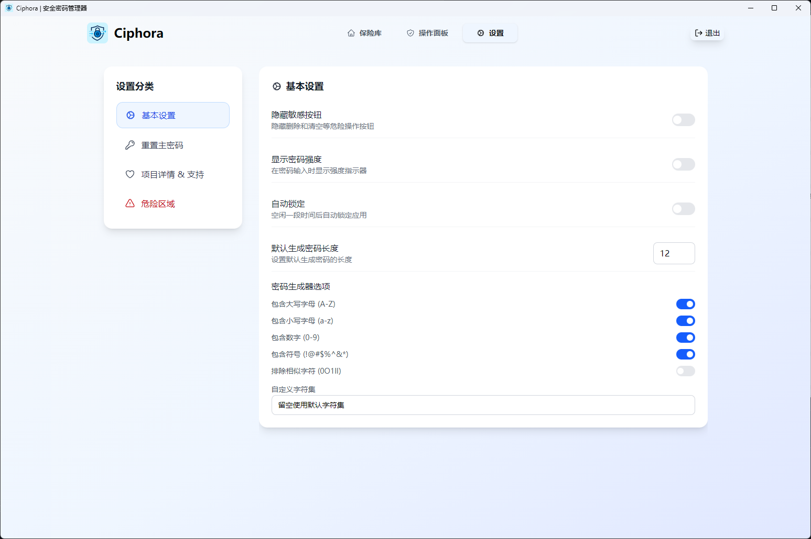

# Ciphora - 安全密码管理器

<div align="center">
  
  
  [](https://opensource.org/licenses/MIT)
  [](https://github.com/cuboart/Ciphora)
  [](https://github.com/cuboart/Ciphora)
</div>

## 📖 项目简介

Ciphora 是一个开源、安全、跨平台的密码管理器，基于 Electron 和 React 构建。它提供了强大的密码管理功能，支持多种数据类型存储、加密备份、多因素认证等企业级安全特性。

### 🖼️ 界面展示

<div align="center">

| 登录界面 | 密码管理 |
|--------|----------|
|  |  |
| 简洁直观的登录管理体验 | 直观的密码列表和操作界面 |

| 控制面板 | 设置界面 |
|----------|----------|
|   |  |
| 简洁的备份和导出功能 | 丰富的配置选项和个性化设置 |

</div>

### ✨ 主要特性

- 🔐 **安全加密**：采用 AES-256 加密算法保护您的数据
- 🎯 **多数据类型**：支持密码、Base64、笔记、TOTP,Json 等多种数据类型
- 🔄 **自动备份**：支持加密备份和恢复功能
- 📱 **多因素认证**：内置 TOTP 支持，增强账户安全
- 🎨 **现代界面**：基于 Tailwind CSS 的美观用户界面
- 🔍 **智能搜索**：快速查找和管理您的密码
- 📊 **密码生成器**：可自定义的强密码生成工具
- 🔒 **自动锁定**：可配置的空闲自动锁定功能
- 📤 **导入导出**：支持多种格式的数据导入导出

## 🚀 快速开始

### 系统要求

- Windows 10/11
- macOS 10.14+
- Linux (Ubuntu 18.04+)

### 安装方法

#### 方法一：下载预编译版本

1. 访问 [Releases](https://github.com/cuboart/Ciphora/releases) 页面
2. 下载适合您操作系统的安装包
3. 运行安装程序

#### 方法二：从源码构建

```bash
# 克隆仓库
git clone https://github.com/cuboart/Ciphora.git
cd Ciphora

# 安装依赖
npm install

# 开发模式运行
npm run dev

# 构建应用
npm run build

# 构建特定平台
npm run build:win    # Windows
npm run build:mac    # macOS  
npm run build:linux  # Linux
```

## 📱 使用指南

### 首次设置

1. **启动应用**：首次运行时会显示设置向导
2. **创建主密码**：设置一个强密码作为主密钥
3. **备份恢复码**：保存好恢复码，以防忘记主密码
4. **完成设置**：开始使用 Ciphora

### 基本功能

#### 添加密码
1. 点击"添加密码"按钮
2. 填写网站、用户名、密码等信息
3. 选择数据类型（密码、信用卡、笔记等）
4. 保存到保险库

#### 管理密码
- **查看**：点击密码项查看详细信息
- **编辑**：修改密码或相关信息
- **删除**：移除不需要的密码项
- **复制**：快速复制密码到剪贴板

#### 搜索功能
- 使用搜索框快速查找密码
- 支持按网站名、用户名等搜索
- 实时搜索结果

### 高级功能

#### 密码生成器
- 自定义密码长度（4-128位）
- 选择字符类型（大小写、数字、符号）
- 排除相似字符选项
- 自定义字符集

#### 多因素认证 (MFA)
1. 在设置中启用 MFA
2. 扫描二维码添加 TOTP 应用
3. 保存备份码
4. 登录时输入验证码

#### 数据备份
- **创建备份**：设置密码保护备份文件
- **恢复备份**：从备份文件恢复数据
- **自动备份**：可配置定期自动备份

#### 导入导出
支持多种格式：
- **导入**：Excel (.xlsx)、CSV (.csv)、Ciphora 备份 (.ciphora)
- **导出**：Excel、CSV、Ciphora 备份格式

## ⚙️ 设置选项


### 安全设置
- **自动锁定**：默认30分钟空闲后自动锁定
- **隐藏敏感按钮**：默认隐藏删除等危险操作按钮
- **显示密码强度**：密码输入时显示强度指示器

### 密码生成器设置
- **默认长度**：设置默认生成密码长度
- **字符选项**：配置包含的字符类型
- **排除相似字符**：默认排除容易混淆的字符（0O1lI）

### 界面设置
- **主题**：系统、浅色、深色主题
- **紧凑模式**：减少界面间距
- **隐藏敏感按钮**：默认开启，提高安全性

## 🔒 安全特性

### 加密机制
- **主密码**：使用 PBKDF2 派生密钥
- **数据加密**：AES-256-GCM 加密算法
- **安全存储**：本地加密存储，不上传云端

### 数据存储位置
- **Windows**: `%APPDATA%/Ciphora/`
- **macOS**: `~/Library/Application Support/Ciphora/`
- **Linux**: `~/.config/Ciphora/`

所有用户数据（密码、设置、备份等）都存储在用户数据目录中，确保：
- 应用更新时数据不会丢失
- 符合各操作系统的数据存储规范
- 具有适当的权限控制

### 忘记主密码的解决方案

如果您忘记了主密码，Ciphora 提供了数据重置功能：

#### 方法一：登录界面重置（推荐）
1. **在登录界面**点击 **"忘记主密码？"**
2. **输入确认文本** `RESET ALL DATA`
3. **二次确认操作**

#### 方法二：设置页面重置
1. **进入设置页面** → **危险区域**
2. **点击"重置所有数据"**
3. **输入确认文本** `RESET ALL DATA`
4. **二次确认操作**

⚠️ **重要提醒**：
- 此操作将**永久删除**所有密码数据和设置
- 操作**无法撤销**
- 这是忘记主密码时的**唯一解决方案**
- 建议在重置前尝试回忆主密码
- 重置后需要重新设置主密码和导入数据

### 安全最佳实践
- 使用强主密码并妥善保管
- 定期备份数据到安全位置
- 启用多因素认证
- 及时更新应用版本
- 考虑将主密码记录在安全的地方

## 🛠️ 开发指南

### 技术栈
- **前端**：React 18 + Tailwind CSS
- **后端**：Node.js + Electron
- **加密**：crypto-js
- **构建**：Vite + Electron Builder

### 项目结构
```
Ciphora/
├── src/                    # 前端源码
│   ├── components/         # React 组件
│   ├── lib/               # 工具库
│   └── index.jsx          # 入口文件
├── server/                # 后端服务
│   ├── services/          # 业务逻辑
│   ├── config/            # 配置文件
│   └── utils/             # 工具函数
├── res/                   # 资源文件
├── main.cjs               # Electron 主进程
└── preload.js             # 预加载脚本
```

### 开发命令
```bash
# 开发模式
npm run dev

# 构建应用
npm run build

# 构建特定平台
npm run build-win    # Windows
npm run build-mac    # macOS
npm run build-linux  # Linux

# 代码检查
npm run lint
```

## 🤝 贡献指南

我们欢迎社区贡献！请遵循以下步骤：

1. Fork 本仓库
2. 创建特性分支 (`git checkout -b feature/AmazingFeature`)
3. 提交更改 (`git commit -m 'Add some AmazingFeature'`)
4. 推送到分支 (`git push origin feature/AmazingFeature`)
5. 开启 Pull Request

### 贡献类型
- 🐛 Bug 修复
- ✨ 新功能开发
- 📚 文档改进
- 🎨 UI/UX 优化
- 🔧 性能优化

## 📄 许可证

本项目采用 MIT 许可证 - 查看 [LICENSE](LICENSE) 文件了解详情。

## 🙏 致谢

感谢以下开源项目：
- [Electron](https://electronjs.org/) - 跨平台桌面应用框架
- [React](https://reactjs.org/) - 用户界面库
- [Tailwind CSS](https://tailwindcss.com/) - CSS 框架
- [Heroicons](https://heroicons.com/) - 图标库

## 📞 支持与反馈

- 🐛 **Bug 报告**：[Issues](https://github.com/cuboart/Ciphora/issues)
- 💡 **功能建议**：[Discussions](https://github.com/cuboart/Ciphora/discussions)
- 📧 **联系邮箱**：support@ciphora.app

## 💝 支持项目

如果 Ciphora 对您有帮助，欢迎支持我们的开发工作：

<div align="center">
  <p>🌸一朵花 ¥1 | 🍋柠檬水 ¥5 | 🧋奶茶 ¥12 | 🍽️午饭 ¥25 | 自定义 ¥?</p>
  
  <p>请我喝杯咖啡，继续完善功能 ☕</p>
  
  <table>
    <tr>
      <td align="center">
        
        <br>
        <strong>微信支付</strong>
      </td>
      <td align="center">
        
        <br>
        <strong>支付宝</strong>
      </td>
    </tr>
  </table>
  
  <p>感谢您的支持！❤️</p>
</div>

---

<div align="center">
  <p>Made with ❤️ by Ciphora Team</p>
  <p>⭐ Star this repository if you like it!</p>
</div>